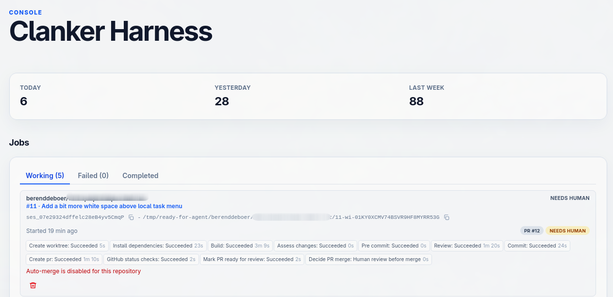

# Ready for Agent: Clanker Harness

Agentic software engineering harness which watches the GitHub issue
queue for issues marked with `ready-for-agent`. Select an issue in the
UI to start working on it.

It does this by creating a new worktree, installing packages, and
asking [OpenCode](https://opencode.ai/) to implement the issue, review
the issue, create a PR, and merge if allowed.

The goal of this clanker harness is to get you to that 50+ PRs merged
a day nirvana. You focus on design, creating specifications, and
turning them into GitHub tickets as per [the Matt Pocock
workflow](https://www.youtube.com/watch?v=M6mYodf0dJM). The harness
allows you to drop that baby-sitting of your agent.

# Usage

Requires a supported platform (Linux or macOS, x64 or arm64). Windows is not
supported in v1.

```bash
npx ready-for-agent@latest
```

Or install the package and use the `ready-for-agent` command:

```bash
npm install -g ready-for-agent
ready-for-agent
```

This opens the UI in the browser
([http://127.0.0.1:6056/](http://127.0.0.1:6056/)). This shows the
configured state. If you open this for the first time, you will be
prompted to set a default build model and thinking level, and configure repos.

## Stop opening a browser window

Disable opening a browser window with:

```bash
ready-for-agent --no-open
# or
NO_BROWSER=1 ready-for-agent
```

## Use a different port

Use a different port than 6056:

```bash
PORT=7000 ready-for-agent
```

## Configuring a repo

If you open ready-for-agent without any repo configured, it will prompt. Add with:

```bash
ready-for-agent add /path/to/local/repo
```

If you use a non-default port:

```bash
READY_FOR_AGENT_GRAPHQL_URL=http://127.0.0.1:7000/graphql \
  ready-for-agent add /path/to/local/repo
```

## Working on issues

Currently the harness does not automatically pick issues to work
on. Click on the kebab menu and implement this end to end via
"Implement now".

You can configure your repo to automatically merge the PR. Default is
for human review to take place. If auto-merge is enabled, the harness
will ask the AI about the risk of auto-merge. Only low risk PRs are
auto-merged, higher risk still require human review.

Pick the "Implement locally" option to implement the issue in the new
worktree, but withoutr creating a PR yet. This allows you to test and verify.



## Assumptions

- You use GitHub.
- You have a repo cloned locally, either "normally" or as a bare clone
  (recommended). Install the [git-bare-worktree
  skill](https://github.com/berenddeboer/git-bare-worktree) and let
  your agent create this setup for you: `npx skills@latest add
  berenddeboer/git-bare-worktree --global`
- The harness is designed to run on your local laptop. This avoids
  cloud costs, and you already paid for an extensive
  machine. Secondly, your machine will be setup for your repo, so we
  avoid the setup issues you get with running compute in the cloud.
- Ideally you have setup a CI pipeline with automated build/test and an AI code review.

# Requirements

**Required on PATH** (start fails fast if missing):

1. [git](https://git-scm.com/)
2. [GitHub CLI (`gh`)](https://cli.github.com/)
3. [OpenCode](https://opencode.ai)

**Optional:**

4. [keymaxxer](https://github.com/glommer/keymaxxer) — vault-backed secrets.
   Resolved as `KEYMAXXER_ENTRYPOINT` when set to an existing path, otherwise
   the `keymaxxer` command on PATH. When neither is available, the harness uses
   ambient GitHub authentication. Set `KEYMAXXER_ENABLED=false` to force that
   mode.

# KeyMaxxer

Ready for Agent supports
[keymaxxer](https://github.com/glommer/keymaxxer), but does not
require it. With KeyMaxxer secrets stay encrypted, and are only
granted to agents when they need them.

Keymaxxer is automatically enabled if keymaxxer is in your path. Disable with:

```
KEYMAXXER_ENABLED=false npx ready-for-agent@latest
```

# Frequently Asked Questions

1. Is there support for agents other than OpenCode?

Not yet, but open for properly structured PRs. Currently everything is
hard-coded for opencode, so the first step would be to make this more
generalisable.

2. Does the harness support any other backend than GitHub?

Not yet. GitLab might be coming soon though.

# Architecture

## GitHub is source of truth

GitHub issues remain the source of truth; the local database is book-keeping.
Style and guidelines come from the target repository—this harness steers an
agent swarm on `ready-for-agent` labeled work.

## Graphql API

The backend is served as graphql api: `http://127.0.0.1:6056/graphql`

## Application data

Product state defaults to the platform data directory:

- Linux: `$XDG_DATA_HOME/ready-for-agent/` or `~/.local/share/ready-for-agent/`
- macOS: `~/Library/Application Support/ready-for-agent/`

The SQLite database is `ready-for-agent.db` in that directory. Set
`SQLITE_DATABASE_PATH` to use another file. Stop the harness completely before
opening the database with external write tooling (single-writer SQLite).

## Contributing

Contributions welcome, see [CONTRIBUTING.md](CONTRIBUTING.md).
