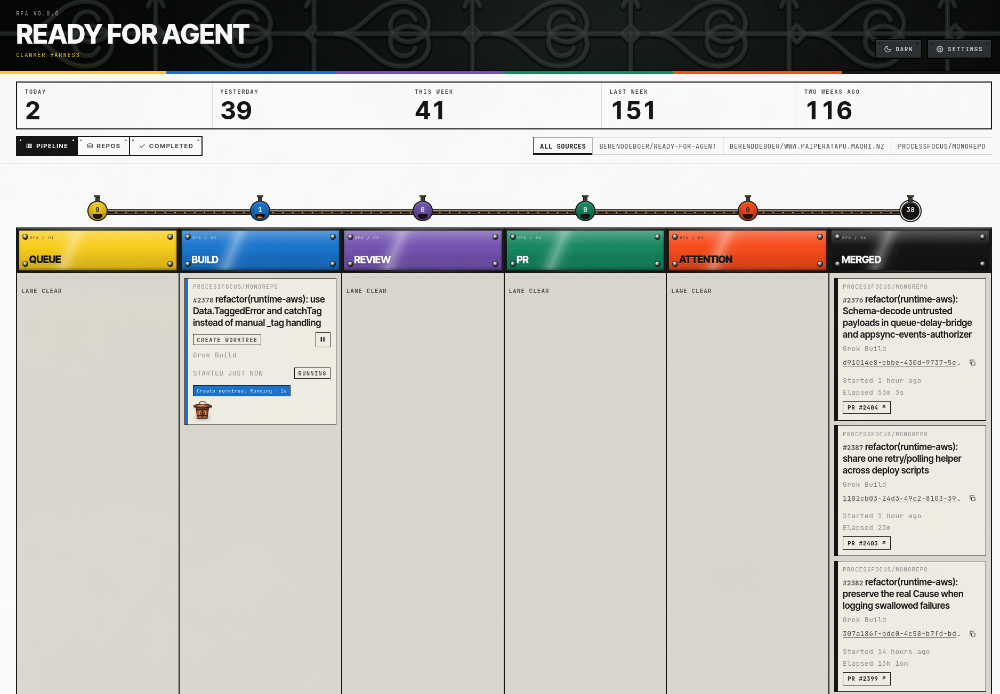
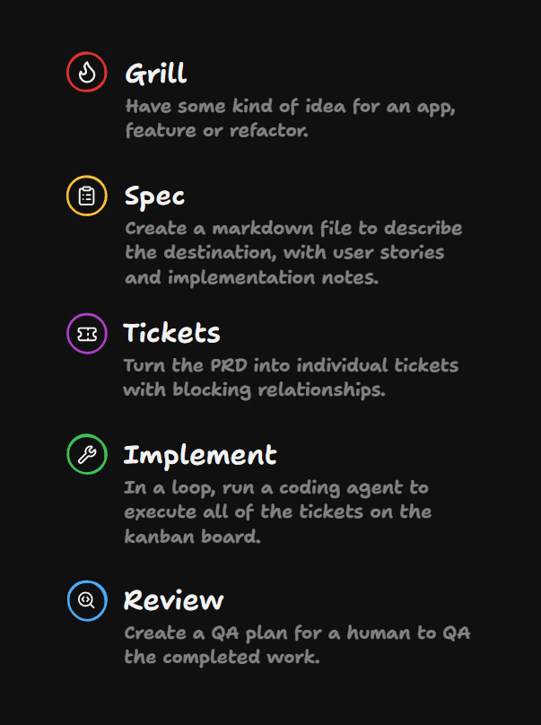

# Ready for Agent: Clanker Harness for 150+ PRs a week

Create issues in GitHub and use this harness to implement them, review
the code, create a PR, and merge the PR. It supports a different way
of working: you talk to your agent to create GitHub issues, and this
harness works on them.

It's a loop based around issues labelled with `ready-for-agent`. The
harness will only show these, you select the ones you want to work on,
and it autonomously completes the task using your preferred coding
agent. You can even select a parent issue, and ready-for-agent will
implement all child issues.



It very much supports a HITL workflow (Human in the Loop): you design,
you architect, you verify where needed.

It works very well if you follow [the Matt Pocock
workflow](https://www.youtube.com/watch?v=M6mYodf0dJM): start a
grilling session, create a specification (`/to-spec`), then create
tickets (`/to-tickets`). These tickets will be labeled with
ready-for-agent, and show up immediately in the harness. Install his
[Skills for Real Engineers](https://github.com/mattpocock/skills) to
get started with this kind of workflow.

Steps 1 to 3 are you. Steps 4 and 5 are the harness.



But as long as an issue has the `ready-for-agent` label, this tool can
work on it.

## How it works

The harness creates a new worktree, installs packages, and asks a
selectable headless Agent Backend ([OpenCode](https://opencode.ai/),
[Codex](https://github.com/openai/codex), [Grok
Build](https://docs.x.ai/), or [Claude
Code](https://docs.anthropic.com/en/docs/claude-code)) to implement the
issue, review the issue, create a PR, and merge if allowed.

The goal of this clanker harness is to get you to that 25+ PRs merged
a day nirvana. It does that by removing the time spent babysitting an
agent and guiding it through the implementation, review, commit, and PR
status-check stages.

See [the introduction
video](https://www.youtube.com/watch?v=TK1OeQZswiQ) to see the tool in
action.

# Usage

Requires a supported platform: Linux, macOS, or Windows (x64 or arm64).

Run:

```bash
npx ready-for-agent@latest
```

Or install the package and use the `ready-for-agent` command:

```bash
npm install -g ready-for-agent
ready-for-agent
```

This opens the UI in the browser
([http://127.0.0.1:6056/](http://127.0.0.1:6056/)). This shows the
configured state. If you open this for the first time, you will be
prompted to set a default build model and effort (thinking), and configure repos.

## Stop opening a browser window

Disable opening a browser window with:

```bash
ready-for-agent --no-open
# or
NO_BROWSER=1 ready-for-agent
```

## Use a different port

Use a different port than 6056:

```bash
PORT=7000 ready-for-agent
```

## Configuring a repo

If you open ready-for-agent without any repo configured, it will prompt. Add with:

```bash
ready-for-agent add /path/to/local/repo
```

If you use a non-default port:

```bash
READY_FOR_AGENT_GRAPHQL_URL=http://127.0.0.1:7000/graphql \
  ready-for-agent add /path/to/local/repo
```

## Working on issues

Currently the harness does not automatically pick issues to work
on. Click on the kebab menu and implement this end to end via
"Implement now".

You can configure your repo to automatically merge the PR. Default is
for human review to take place. If auto-merge is enabled, the harness
will ask the AI about the risk of auto-merge. Only low risk PRs are
auto-merged, higher risk still require human review.

Pick the "Implement locally" option to implement the issue in the new
worktree, but without creating a PR yet. This allows you to test and verify.

## Assumptions

- You use GitHub or GitLab.
- You have a repo cloned locally, either "normally" or as a bare clone
  (recommended). Install the [git-bare-worktree
  skill](https://github.com/berenddeboer/git-bare-worktree) and let
  your agent create this setup for you: `npx skills@latest add
  berenddeboer/git-bare-worktree --global`
- The harness is designed to run on your local laptop. This avoids
  cloud costs, and you already paid for an extensive
  machine. Secondly, your machine will be set up for your repo, so we
  avoid the setup issues you get with running compute in the cloud.
- Ideally, you have set up a CI pipeline with automated build/test and an AI code review.

# Requirements

**Always required on PATH** (start fails fast if missing):

1. [git](https://git-scm.com/)

**Forge-specific tools** (required only when at least one Repository uses that
Forge):

2. [GitHub CLI (`gh`)](https://cli.github.com/) for GitHub Repositories
3. [curl](https://curl.se/) for GitLab Repositories. `glab` is an optional
   ambient credential source, not a required host tool.

**Agent Backend executable** (only the backend selected in Settings is
required; default is OpenCode):

4. [OpenCode](https://opencode.ai/) (`opencode` on PATH) when OpenCode is the
   selected Agent Backend
5. [Codex](https://github.com/openai/codex) (`codex` on PATH) when Codex is the
   selected Agent Backend
6. [Grok Build](https://docs.x.ai/) (`grok` on PATH) when Grok Build is the
   selected Agent Backend
7. [Claude Code](https://docs.anthropic.com/en/docs/claude-code) (`claude` on
   PATH) when Claude Code is the selected Agent Backend

Authenticate Grok Build with `grok login` or `XAI_API_KEY` before Recheck /
Agent Turns. Harness-launched Grok processes disable auto-update for that
session (`--no-auto-update` / `GROK_DISABLE_AUTOUPDATER`). Grok Build Agent
Turns do not integrate Keymaxxer; Session Telemetry is live-read from on-disk
Grok session files under `$GROK_HOME/sessions` (default `~/.grok`). Authenticate
Claude Code with `claude auth login` or `ANTHROPIC_API_KEY` before Recheck /
Agent Turns. For **Amazon Bedrock**, set `CLAUDE_CODE_USE_BEDROCK=1` plus AWS
credentials/region on the harness process instead of first-party login; see
[Claude Code on Amazon Bedrock](docs/claude-code-amazon-bedrock.md) (Ready vs
Unavailable, **Amazon Bedrock** provider label, profile-only catalog from the
bundled AWS SDK—not the AWS CLI—Settings free-text, and optional env pins for
first-party aliases). Harness-launched Claude processes disable auto-update for
that session (`DISABLE_AUTOUPDATER`). Claude Code Agent Turns do not integrate
Keymaxxer; Session Telemetry is unsupported in v1. Opt-in live adapter tests
use `GROK_INTEGRATION=1` / `OPENCODE_INTEGRATION=1` / `CODEX_INTEGRATION=1` /
`CLAUDE_INTEGRATION=1` / `BEDROCK_INTEGRATION=1` (list-only; never invokes a
model); normal CI does not need paid model credentials.

# KeyMaxxer

Ready for Agent supports
[keymaxxer](https://github.com/glommer/keymaxxer), but does not
require it. With KeyMaxxer secrets stay encrypted, and are only
granted to agents when they need them.

Keymaxxer is automatically enabled if keymaxxer is in your path. Disable with:

```
KEYMAXXER_ENABLED=false npx ready-for-agent@latest
```

# Frequently Asked Questions

1. Is there support for agents other than OpenCode?

Yes. Settings can select [OpenCode](https://opencode.ai/),
[Codex](https://github.com/openai/codex), [Grok Build](https://docs.x.ai/), or
[Claude Code](https://docs.anthropic.com/en/docs/claude-code) as the
instance-wide Agent Backend. The change hot-activates on Save when no Work
Items are unfinished (including Needs Human). Model catalogs and effort
(thinking) options are backend-local, and build/review prefs are remembered per
backend.

2. Can I run Claude Code through Amazon Bedrock?

Yes. Export `CLAUDE_CODE_USE_BEDROCK=1` and your AWS credentials/region on the
harness process, select Claude Code, then Recheck. Status shows
**Claude Code · Amazon Bedrock**. In Bedrock mode the Agent Model catalog lists
active Anthropic system-defined and application inference profiles from AWS via
the bundled SDK (no AWS CLI host tool; friendly names in Settings; ID/ARN
stored and passed to Claude Code), or free-text a profile ID/ARN. First-party
Claude Code keeps the static alias catalog and never calls AWS. Discovery
failures leave Claude Ready with a warning and free-text entry; listing does
not prove InvokeModel access. Details:
[docs/claude-code-amazon-bedrock.md](docs/claude-code-amazon-bedrock.md).

3. Does the harness support a Forge other than GitHub?

Yes. GitLab Repository identity, Issue reconciliation, and local Agent Turns
through Review are supported. GitLab Pull Request lifecycle operations are
being delivered in later phases.

4. Can I implement something locally, and then check myself?

Yes, pick "Implement locally" from the kebab menu. Everything stays
local, and no commit is made.

# Architecture

## The Forge is source of truth

Issues on the configured Repository Forge (GitHub/GitLab) remain the
source of truth; the local database is book-keeping. Style and
guidelines come from the target repository—this harness steers an
agent swarm on `ready-for-agent` labeled work.

## GraphQL API

The backend serves a GraphQL API at `http://127.0.0.1:6056/graphql`.

## Ontology-based domain model

The Work Item lifecycle is driven by a machine-readable ontology under
`ontology/` (Turtle + SHACL), not by ad-hoc enums scattered through the
code. States, legal transitions, guards, and glossary terms are declared
there; TypeScript types, GraphQL enums, database columns, and the runtime
transition check are generated from or validated against it. Agents propose
work; the ontology defines what a state means and which moves are legal.
See [ontology/README.md](ontology/README.md) and
[docs/why-agentic-systems-need-ontologies.md](docs/why-agentic-systems-need-ontologies.md).

## Application data

Product state defaults to the platform data directory:

- Linux: `$XDG_DATA_HOME/ready-for-agent/` or `~/.local/share/ready-for-agent/`
- macOS: `~/Library/Application Support/ready-for-agent/`

The SQLite database is `ready-for-agent.db` in that directory. Set
`SQLITE_DATABASE_PATH` to use another file. Stop the harness completely before
opening the database with external write tooling (single-writer SQLite).

# Contributing

Contributions welcome, see [CONTRIBUTING.md](CONTRIBUTING.md).

# Related work

- Inspired by [this blog post](https://lovable.dev/blog/85000-in-tokens-later-scaling-agentic-coding-at-lovable) from Alexander at Lovable
- ready-for-agent is an example of a [metaharness](https://metaharness.tools/).
