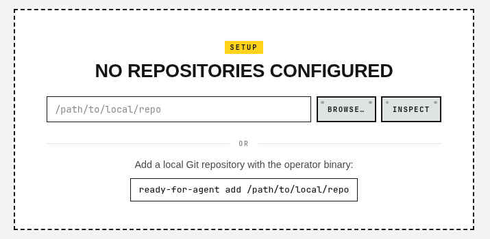
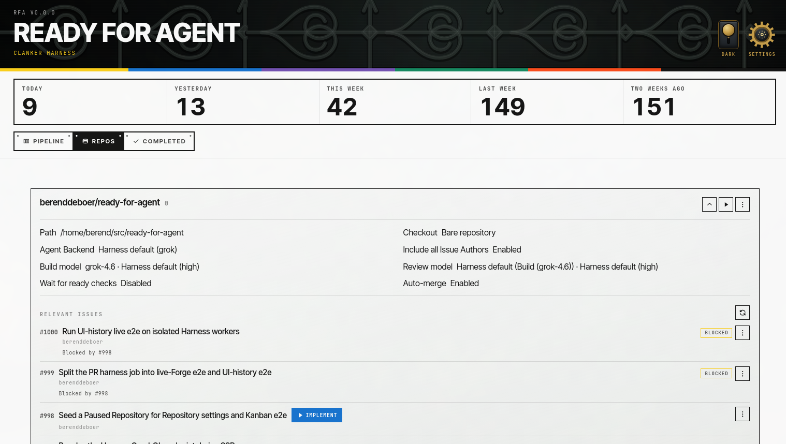
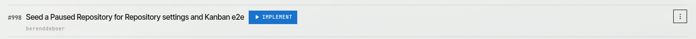
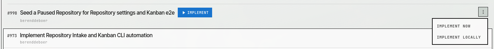

# Ready for Agent: Clanker Harness for 150+ PRs a week

Ready for Agent turns GitHub (or GitLab) issues into merged pull
requests. You create issues and label them `ready-for-agent`; the
harness hands each one to your preferred coding agent, which
implements it, reviews the code, opens a PR, and merges when
allowed. You design, you architect, you verify where needed — the
harness removes the babysitting between issue and merged PR.


Watch [the introduction
video](https://www.youtube.com/watch?v=TK1OeQZswiQ) to see the tool in
action.

## Quick start

1. Install the [prerequisites](#requirements) and have them on your PATH:
   [git](https://git-scm.com/), the [GitHub CLI
   (`gh`)](https://cli.github.com/), and at least one coding agent —
   [OpenCode](https://opencode.ai/),
   [Codex](https://github.com/openai/codex), [Grok
   Build](https://docs.x.ai/), or [Claude
   Code](https://docs.anthropic.com/en/docs/claude-code) —
   authenticated per its own documentation.
2. Start the harness:

   ```bash
   npx ready-for-agent@latest
   ```

   Or install it once with `npm install -g ready-for-agent` and run
   `ready-for-agent`. The UI opens at
   [http://127.0.0.1:6056/](http://127.0.0.1:6056/). On first run it
   takes you to Settings to pick your coding agent and a default build
   model and effort (thinking).

3. Add a local Git repo from the UI. After start, the blank slate
   prompts you to pick the first repository:

   - Use **Browse…** when shown (Windows, macOS, and typical Linux
     desktops), or paste a host path into the field.
   - Click **Inspect**, confirm the forge identity, then **Confirm and
     add**.

   

   Advanced: once the harness is running, you can also add from a
   shell:

   ```bash
   ready-for-agent add /path/to/local/repo
   ```

4. Label a GitHub issue with `ready-for-agent`. It shows up in the UI
   shortly. By default only issues you authored are listed — see
   [Troubleshooting](#troubleshooting).

5. Go to the `/repos` page to see your issues:



6. Click the **implement** button to run it end to end — implement,
   review, PR



   Alternatively you can open the issue's kebab menu and pick **Implement
   locally** to stop before the PR and inspect the work yourself.



## Requirements

A supported platform: Linux, macOS, or Windows (x64 or arm64).

**Always required on PATH** (start fails fast if missing):

- [git](https://git-scm.com/)

**Forge-specific tools** (required only when at least one repository
uses that Forge):

- [GitHub CLI (`gh`)](https://cli.github.com/) for GitHub repositories
- [GitLab CLI (`glab`)](https://docs.gitlab.com/cli/) for GitLab repositories.
  Authenticate `glab` for each repository's Forge Host.

**Coding agents** are soft prerequisites: they are inspected after
the harness starts and never block the process or UI from starting. A
missing or broken selected backend (default is OpenCode) is shown as
**Agent Backend Unavailable**; open Settings to choose another
backend, reinstall the CLI, or use Recheck after fixing it:

- [OpenCode](https://opencode.ai/) (`opencode` on PATH)
- [Codex](https://github.com/openai/codex) (`codex` on PATH)
- [Grok Build](https://docs.x.ai/) (`grok` on PATH)
- [Claude Code](https://docs.anthropic.com/en/docs/claude-code)
  (`claude` on PATH)

We assume your coding agent is installed and authenticated — see its
own documentation. To run Claude Code through Amazon Bedrock instead
of a first-party login, see
[docs/claude-code-amazon-bedrock.md](docs/claude-code-amazon-bedrock.md).

You also need:

- A repo cloned locally, either "normally" or as a bare clone
  (recommended). Install the [git-bare-worktree
  skill](https://github.com/berenddeboer/git-bare-worktree) and let
  your agent create this setup for you: `npx skills@latest add
  berenddeboer/git-bare-worktree --global`
- Ideally, a CI pipeline with automated build/test and an AI code
  review.

The harness is designed to run on your local laptop. This avoids
cloud costs — you already paid for an extensive machine — and your
machine is already set up for your repo, so you avoid the setup
issues that come with running compute in the cloud.

## Features

- Four interchangeable coding agents — OpenCode, Codex, Grok Build,
  and Claude Code — switchable instance-wide.
- Per-repo agent and model overrides: expensive models for hard
  repos, cheaper ones for the rest.
- Auto-merge gated by an AI risk assessment: only low-risk PRs merge
  unattended, higher risk still requires human review.
- "Implement locally" to inspect the work before any commit or PR
  exists.
- Select a parent issue and it implements all child issues.
- Optionally include `ready-for-agent` issues created by any author,
  not just issues you created yourself.
- Runs on your laptop against your existing local clone — no cloud
  spend, no environment drift.
- Works with your existing Claude (or other) subscription rather than
  metered API billing.
- GitHub and GitLab support.
- Human in the loop where you want it: you design, you architect, you
  verify.

## How it works

The harness is a loop around issues labelled `ready-for-agent`: it
only shows those, you pick the ones to work on, and it autonomously
completes them using your selected coding agent. For each issue it
creates a fresh worktree, installs packages, and asks the headless
agent to implement the issue, review the code, create a PR, and merge
if allowed.

Steps 1 to 3 are you. Steps 4 and 5 are the harness.


The goal of this clanker harness is to get you to that 150+ PRs a
week nirvana. It does that by removing the time spent babysitting an
agent and guiding it through the implementation, review, commit, and
PR status-check stages.

It works very well if you follow [the Matt Pocock
workflow](https://www.youtube.com/watch?v=M6mYodf0dJM): start a
grilling session, create a specification (`/to-spec`), then create
tickets (`/to-tickets`). These tickets will be labeled with
`ready-for-agent`, and show up immediately in the harness. Install his
[Skills for Real Engineers](https://github.com/mattpocock/skills) to
get started with this kind of workflow.

But as long as an issue has the `ready-for-agent` label, this tool
can work on it.

### Working on issues

Currently the harness does not automatically pick issues to work
on. Click on the kebab menu and implement an issue end to end via
"Implement now".

You can configure your repo to automatically merge the PR. Default is
for human review to take place. If auto-merge is enabled, the harness
will ask the AI about the risk of auto-merge. Only low risk PRs are
auto-merged, higher risk still require human review.

Pick the "Implement locally" option to implement the issue in the new
worktree, but without creating a PR yet. This allows you to test and
verify before a commit or PR exists.

## Configuration

### Stop opening a browser window

Disable opening a browser window with:

```bash
ready-for-agent --no-open
# or
NO_BROWSER=1 ready-for-agent
```

### Use a different port

Use a different port than 6056:

```bash
PORT=7000 ready-for-agent
```

### Listen on all interfaces (or a specific address)

By default the Harness binds loopback only (`127.0.0.1`). To reach the UI or
GraphQL from another machine, container, or remote desktop, opt in with
Vite-style `--host` / `HOST` (the Keymaxxer Sidecar stays on `127.0.0.1`):

```bash
# all interfaces (0.0.0.0)
ready-for-agent start --host
# or
HOST=0.0.0.0 ready-for-agent start

# a single address
ready-for-agent start --host 192.168.1.10
```

The flag wins when both `--host` and `HOST` are set.

When adding a repo via the CLI against a non-default port or host (Harness must
already be running):

```bash
READY_FOR_AGENT_GRAPHQL_URL=http://127.0.0.1:7000/graphql \
  ready-for-agent add /path/to/local/repo

# non-loopback Harness (use a host/port the CLI machine can reach):
READY_FOR_AGENT_GRAPHQL_URL=http://<reachable-host>:<port>/graphql \
  ready-for-agent add /path/to/local/repo
```

### Per-repo settings

Each repo can override the harness-wide coding agent and build/review
models, and enable auto-merge. This allows you to configure more
expensive models for more complex code, and cheaper models for
others.

### KeyMaxxer

Ready for Agent supports
[keymaxxer](https://github.com/glommer/keymaxxer), but does not
require it. With KeyMaxxer secrets stay encrypted, and are only
granted to agents when they need them.

Keymaxxer is automatically enabled if keymaxxer is in your path.
Disable with:

```bash
KEYMAXXER_ENABLED=false npx ready-for-agent@latest
```

## Troubleshooting

### Startup fails with "Required host tools are missing from PATH"

Install the listed tools. Only `git` and the Forge tool for your
repositories (`gh` for GitHub, `glab` for GitLab) block startup. A
missing coding agent never does — it shows as Unavailable instead
(see below).

### Startup fails with SIGILL / "Illegal instruction"

The published Linux x64 binary is compiled with Bun's
`bun-linux-x64-baseline` target so CPUs with SSE4.2 but without
AVX2/BMI2 (for example Ivy Bridge) can run it. Older x64 CPUs without
SSE4.2 remain unsupported. If an older install still dies with `SIGILL`
or `Illegal instruction`, reinstall:

```bash
npx ready-for-agent@latest
```

`npx` can swallow the crash and print nothing. Run the platform
binary directly, or look for a launcher message that names
`bun-linux-x64-baseline`. Source checkouts on the same machine are
unaffected (`bun run ready-for-agent`).

### A labelled issue does not show up

- The issue must carry the `ready-for-agent` label — the harness only
  shows those.
- By default only issues **you** authored are listed. If someone else's
  `ready-for-agent` issue is missing, enable **Include all Issue Authors**
  in the repo settings to include issues created by any author.

### The coding agent shows as Unavailable

Its executable is missing from PATH, or it is not authenticated. Fix
that and use Recheck in Settings, or pick another backend there.

### Startup fails with "Cannot establish a trusted TLS connection"

Corporate TLS-inspection proxies (Netskope, Zscaler, Palo Alto,
mitmproxy, and similar) present a private root CA. `git`, `gh`, and
`curl` usually trust it via the OS keychain, but Ready for Agent runs
on Bun, which does **not** read that store — every GitHub/GitLab API
call then fails with a certificate error such as
`SELF_SIGNED_CERT_IN_CHAIN`.

On startup the harness probes each configured forge API host. When
TLS trust fails it stops immediately and prints the remedy. Export
your corporate root CA and point Bun at it with
`NODE_EXTRA_CA_CERTS` (honoured by the compiled binary as well):

```bash
# macOS — Netskope example (adjust -c to your proxy CA common name):
security find-certificate -a -c certadmin -p \
  /Library/Keychains/System.keychain > ~/.config/corp-ca.pem
export NODE_EXTRA_CA_CERTS=~/.config/corp-ca.pem

# Linux — use the PEM your IT provides:
export NODE_EXTRA_CA_CERTS=/path/to/corp-root-ca.pem
```

Set the variable in your shell profile (or the service unit that
starts the harness) so it applies on every launch, then restart
`ready-for-agent`.

### What if an item fails with an error message?

Agents have strict budgets, so the most common one is that it run out
of tries. Simply click retry.

You can always inspect the session locally if the error message is unclear, for example:

```
opencode -s ses_015198f50ffe6aMS7EDvD1U6ob
```

## Frequently Asked Questions

1. What coding CLI agents are supported?

[OpenCode](https://opencode.ai/),
[Codex](https://github.com/openai/codex), [Grok
Build](https://docs.x.ai/), and [Claude
Code](https://docs.anthropic.com/en/docs/claude-code). Settings
selects the instance-wide Agent Backend; the change hot-activates on
Save when no Work Items are unfinished. Model catalogs and effort
(thinking) options are backend-local, and build/review preferences
are remembered per backend. Models are always picked from the
backend's current catalog, never typed in.

2. Does the harness support a Forge other than GitHub?

Yes. GitLab repository identity, issue reconciliation, and local
agent work through review are supported. GitLab pull request
lifecycle operations are being delivered in later phases.

3. Can I use my Claude subscription?

Yes, since we use Claude Code directly instead of the API, this is
permissible usage.

4. Can I run Claude Code through Amazon Bedrock?

Yes. See
[docs/claude-code-amazon-bedrock.md](docs/claude-code-amazon-bedrock.md).

5. Can I implement something locally, and then verify the work myself?

Yes — pick "Implement locally" from the kebab menu; see [Working on
issues](#working-on-issues).

6. Can I use a different model or coding agent per repo?

Yes — see [Per-repo settings](#per-repo-settings).

7. Does ready-for-agent help me to create GitHub issues?

No, this tool deliberately starts with existing issues. Creating these
issues is a very different scope. It falls into the category of a
software factory. [Victor Savkin](https://x.com/victorsavkin) has done
a very nice [write-up of what these tools
do](https://x.com/victorsavkin/status/2085381771516846093): they start
with finding work, they are not explorer work or creating work.

## Glossary

- **Clanker** — affectionate slang for a robot; here, the coding
  agent doing the work.
- **Harness** — this tool: the deterministic loop that steers
  clankers from issue to merged PR.
- **Forge** — the code-hosting platform for a repository: GitHub or
  GitLab.
- **Agent Backend** — the coding-agent CLI the harness drives:
  OpenCode, Codex, Grok Build, or Claude Code.
- **Work Item** — one attempt to complete an issue through the work
  lifecycle, from implementation to merged PR.
- **Agent Turn** — one unattended invocation of the coding agent
  within a Work Item.
- **Needs Human** — a Work Item state where the harness cannot
  continue autonomously and hands back to you, recording why.
- **Recheck** — a Settings action that revalidates a coding agent and
  refreshes its model catalog.
- **Metaharness** — a harness that steers agent harnesses; see
  [metaharness.tools](https://metaharness.tools/).

The full domain language lives in [CONTEXT.md](CONTEXT.md), derived
from a versioned ontology under [`ontology/`](ontology/README.md).

## Architecture

Issues on the Forge remain the source of truth; the local SQLite
database is book-keeping. The backend serves a GraphQL API at
`http://127.0.0.1:6056/graphql`, and the Work Item lifecycle is
driven by a machine-readable ontology rather than ad-hoc enums.
Details in [ARCHITECTURE.md](ARCHITECTURE.md),
[CONTEXT.md](CONTEXT.md), [ontology/README.md](ontology/README.md),
and
[docs/why-agentic-systems-need-ontologies.md](docs/why-agentic-systems-need-ontologies.md).

## Contributing

Contributions welcome, see [CONTRIBUTING.md](CONTRIBUTING.md).

## License

[MIT](LICENSE).

## Related work

- Inspired by [this blog
  post](https://lovable.dev/blog/85000-in-tokens-later-scaling-agentic-coding-at-lovable)
  from Alexander at Lovable
- ready-for-agent is an example of a
  [metaharness](https://metaharness.tools/).
- Victor Savkin describes [the workflow very
  well](https://x.com/victorsavkin/status/2085381771516846093),
  although we disagree on whether the tooling is always personal, or
  can be generalised a bit. Obviously my take is that with regards to
  GitHub/GitLab systems, and a single programmer a tool like
  ready-for-agent can give a significant productivity boost.
