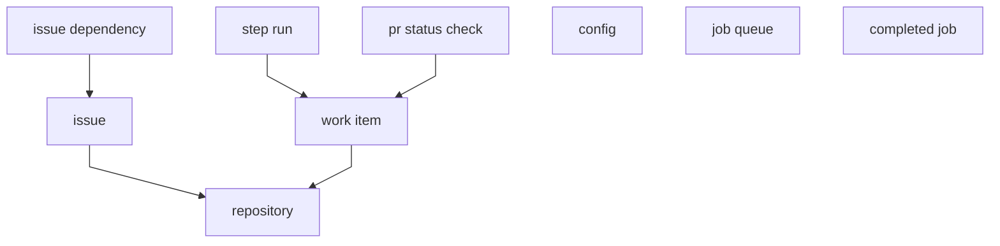

# About

Drizzle table definitions and SQL migrations for the harness bookkeeping DB (Turso/SQLite). Schema and migrations only — no connection or queries.

```bash
bun run generate   # drizzle-kit generate
bun run typecheck
```

## Xplain Diagram

Abstraction hierarchy (referencing type above referenced type; has-a top-down):

```text
  ┌──────────────────┐   ┌───────────┐   ┌──────────────────┐
  │ issue dependency │   │ step run  │   │ pr status check  │
  └────────┬─────────┘   └─────┬─────┘   └────────┬─────────┘
           │                   │                    │
           ▼                   └────────┬───────────┘
  ┌──────────────────┐                  ▼
  │      issue       │         ┌──────────────────┐
  └────────┬─────────┘         │    work item     │
           │                   └────────┬─────────┘
           │                            │
           └──────────────┬─────────────┘
                          ▼
                 ┌──────────────────┐
                 │   repository     │
                 └──────────────────┘

  ┌──────────┐   ┌───────────┐   ┌───────────────┐
  │  config  │   │ job queue │   │ completed job │
  └──────────┘   └───────────┘   └───────────────┘
```
Mermaid version:



## Xplain Schema

Our database expressed as [Xplain schema](https://www.jhterbekke.net/DataLanguage.html).
```text
database ready_for_agent.

type repository = github owner, github repo, local path, is bare, paused,
                  default model, default variant, review model, review variant,
                  auto merge, issues reconciled at.

type config = default model, default variant, review model, review variant,
              max concurrent opencode sessions, max concurrent work items.

type issue = repository, github issue number, title, body, url, state,
             github created at, parent github issue number,
             parent github issue url, parent position, has children.

type issue dependency = issue, blocking github issue number,
                        blocking github issue url.

type job queue = queue, key, job payload, job attempts, job retry limit,
                 available at, locked until.

type completed job = queue, job id.

type work item = repository, github issue number, issue title,
                 github pull request number, model, variant,
                 review model, review variant, state, state ready at,
                 paused, waiting since, holds worker slot, pause before step,
                 worktree path, starting commit oid, completion summary,
                 session id, failure code, failure message.

type step run = work item, step, status, queue job id,
                queued at, started at, finished at, reason code, reason message.

type pr status check = work item, external id, name, outcome,
                       handled at, observed at.
```

**Roles (FK has-a):** `issue` / `work item` → `repository`; `issue dependency` → `issue`; `step run` / `pr status check` → `work item`.

**Not true roles (no FK):** issue parent fields, issue-dependency blocking number/url, `work item.github_issue_number`, `step_run.queue_job_id`, `completed_job.job_id`.
